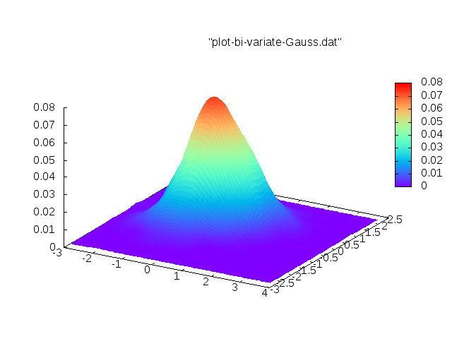

# KernelDensityEstimation

Kernel Density Estimation in c++

# dependencies

We need [nanoflann](https://github.com/jlblancoc/nanoflann). This is a header only library.

# build instructions

    $ git clone https://github.com/tbs1980/KernelDensityEstimation.git
    $ mkdir build
    $ cd build
    $ cmake -DNANOFLANN_ROOT=path-to-nanoflann ../
    $ make
